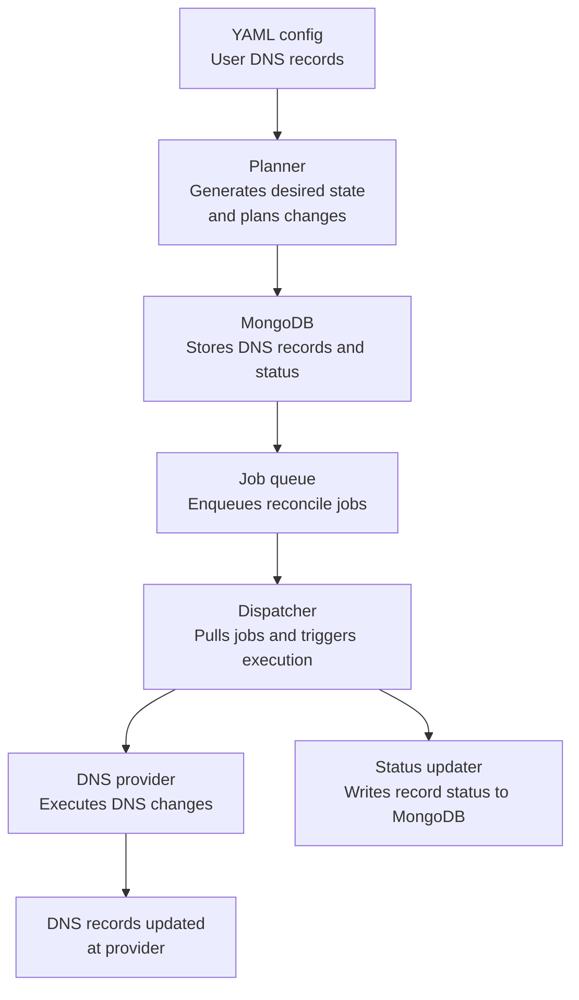

# DNS Provisioning Job Queue

Automated DNS record provisioning and job queue management


## Table of Contents
- [Overview](#overview)
- [Features](#features)
- [Getting Started](#getting-started)
- [Configuration](#configuration)
- [Usage](#usage)
- [Project Structure](#project-structure)


## Overview

This project provides a job queue system for automating DNS record provisioning. It is designed to manage, plan, and execute DNS changes efficiently, supporting multiple providers and record types.

## Workflow Diagram



## Features
- Job queue for DNS record operations
- Pluggable provider support
- Configurable record planning and execution
- YAML-based configuration for DNS records
- Modular and extensible codebase

## Getting Started

### Prerequisites
- Python 3.8+
- [Poetry](https://python-poetry.org/) for dependency management

### Installation

Clone the repository:
```bash
git clone https://github.com/yourusername/dns-provisioning-job-queue.git
cd dns-provisioning-job-queue
```

Install dependencies:
```bash
poetry install
```

## Configuration

Sample configuration files are provided in the `config/` directory:
- `example-records.yaml`
- `example-records-v2.yaml`

Edit these files to define your DNS records and job queue settings.

## Usage

To simulate DNS job queue processing:
```bash
poetry run python3 -m simulate
```

To run the main job queue (if applicable):
```bash
poetry run python3 -m src.dns_queue.main
```

## Project Structure
```
├── config/                # Example configuration files
├── src/dns_queue/         # Core package
│   ├── enums.py           # Enums for job types, statuses, etc.
│   ├── executor.py        # Job execution logic
│   ├── main.py            # Main entry point
│   ├── models.py          # Data models
│   ├── planner.py         # Planning logic
│   ├── providers.py       # DNS provider integrations
│   ├── queue.py           # Job queue implementation
│   └── __init__.py
├── simulate.py            # Simulation script
├── pyproject.toml         # Poetry configuration
└── README.md              # Project documentation
```

